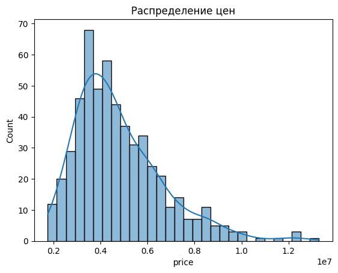
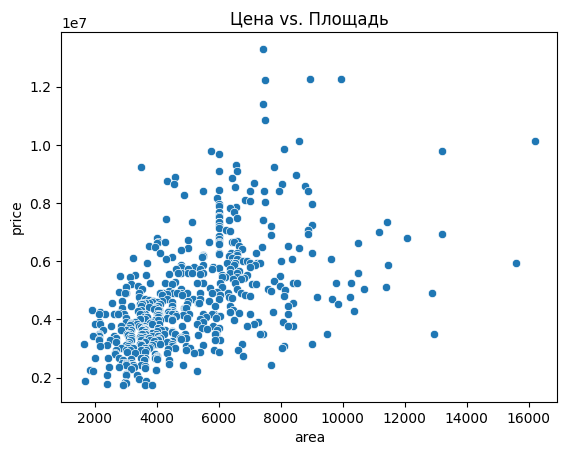
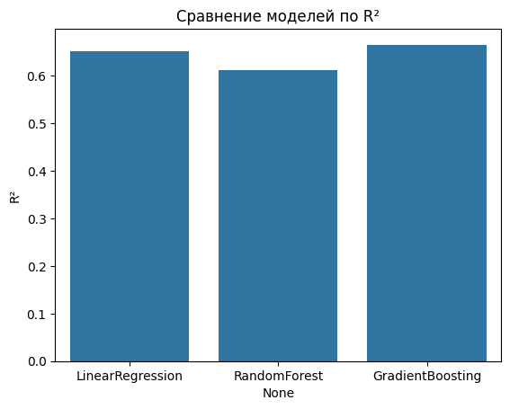

# Housing Price Analysis

## Overview

This project analyzes housing market data using Python and exploratory data analysis techniques.

The goal of the analysis is to identify the key factors that influence housing prices and visualize important relationships in the dataset.

## Technologies

- Python
- pandas
- numpy
- matplotlib
- seaborn
- scikit-learn

## Analysis Steps

The project includes several stages of data analysis:

- data cleaning and preprocessing
- exploratory data analysis
- visualization of price distributions
- correlation analysis
- regression modeling

## Key Insights

The analysis shows that housing prices are strongly influenced by:

- property size
- number of rooms
- location
- infrastructure availability

Visualization techniques help reveal patterns and relationships in housing market data.

## Project Structure

notebook/ — Jupyter Notebook with the full analysis
data/ — dataset used in the project
images/ — charts and visualizations

## Example Visualizations

### Price Distribution

### Correlation Matrix

### Regression Results

## Skills Demonstrated

- Data analysis
- Python programming
- Data visualization
- Statistical analysis
- Exploratory data analysis
